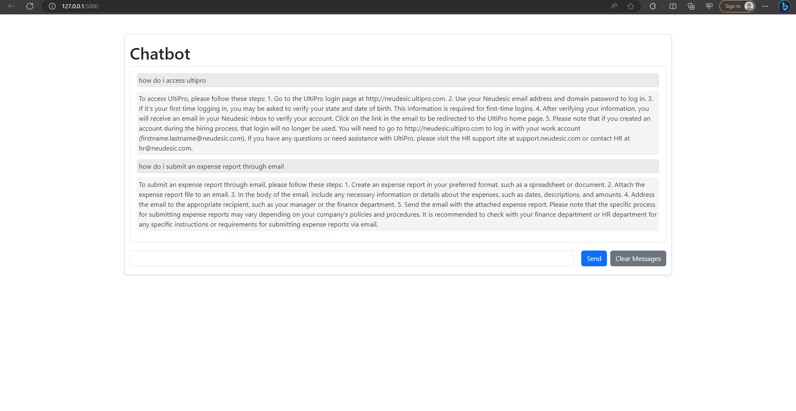

This was a hackathon project I did for Neudesic. It's a simple support chatbot using Azure OpenAI and Freshservice to answer support questions for users using Neudesic's support documentation.

### Azure OpenAI/Freshservice Development Setup
- Install docker desktop

- Install the Dev Container extension in VS Code - https://marketplace.visualstudio.com/items?itemName=ms-vscode-remote.remote-containers

- Click "Open in Remote Window" button on bottom left corner of vscode
- Select "Reopen in container"
- If it asks you to select a workspace, open the root directory folder
- Add your Azure OpenAPI key to openai.py
- Add your Freshservice api key to freshservice_client.py
- Interact with integrated terminal in VSCode
```bash
$ flask --app src/app run --debug
* Serving Flask app 'src/app'
 * Debug mode: on
WARNING: This is a development server. Do not use it in a production deployment. Use a production WSGI server instead.
 * Running on http://127.0.0.1:5000
Press CTRL+C to quit
 * Restarting with stat
 * Debugger is active!
 * Debugger PIN: 917-787-033
```
- Open web browser http://127.0.0.1:5000



- Optional. Install the Docker VSCode extension (To edit docker files.) - https://marketplace.visualstudio.com/items?itemName=ms-azuretools.vscode-docker